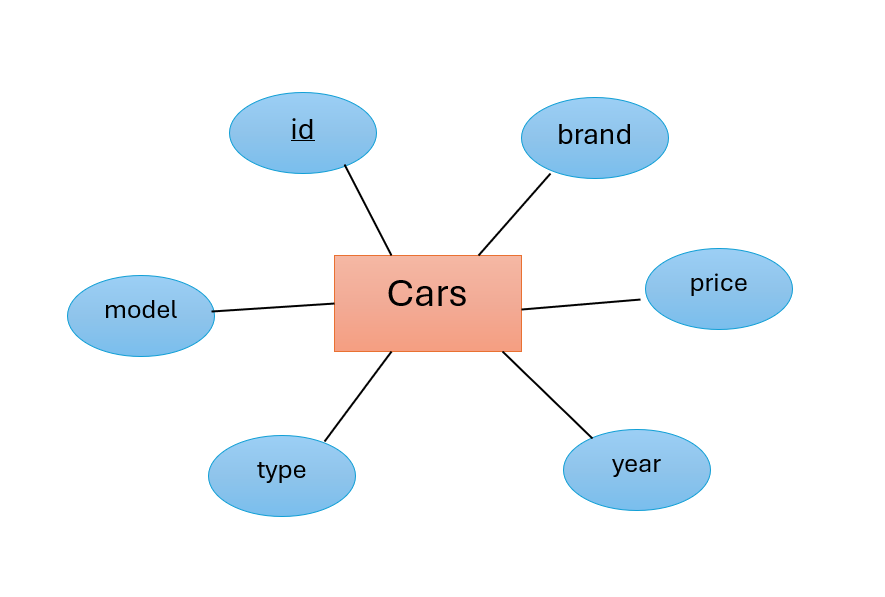

# Ex02 Django ORM Web Application
## Date: 

## AIM
To develop a Django application to store and retrieve data from Car Inventory Database using Object Relational Mapping(ORM).

## ENTITY RELATIONSHIP DIAGRAM



## DESIGN STEPS

### STEP 1:
Clone the problem from GitHub

### STEP 2:
Create a new app in Django project

### STEP 3:
Enter the code for admin.py and models.py

### STEP 4:
Execute Django admin and create details for 10 books

## PROGRAM

model.py:
```
from unittest.util import _MAX_LENGTH
from django.db import models
from django.forms import IntegerField

# Create your models here.
class Car(models.Model):
    id = models.IntegerField(primary_key=True)
    brand = models.CharField(max_length=15)
    model = models.CharField(max_length=40)
    year = models.DateField()
    price = models.IntegerField()
    type = models.CharField(max_length=10)

```

admin.py:
```
from django.contrib import admin
from . models import Car
# Register your models here.

admin.site.register(Car)

class CarAdmin(admin.ModelAdmin):
    list_display = ('id','brand','model','year','price','type')
```


## OUTPUT

Include the screenshot of your admin page.


## RESULT
Thus the program for creating a database using ORM hass been executed successfully
